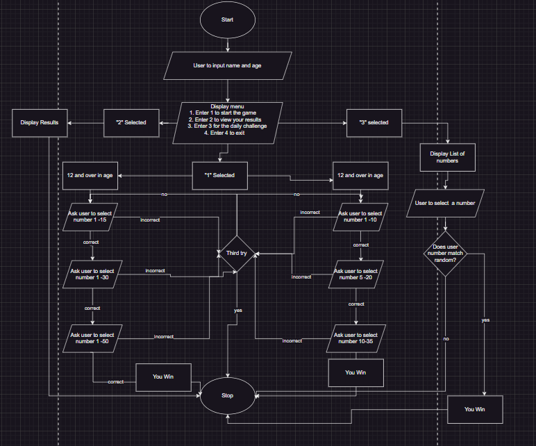

# Random Number Game

## GitHub Link [T1A3 APP](https://github.com/fabs-pe/T1A3)

## Monday.com Link [Implementation Plan](https://coderacademy-gang.monday.com/users/sign_up?invitationId=28019481023943442000)

---

## Code Style Guide

Python programming language will be used to create this application. Also i will be maing use of a few python libaries, VS Code will be used and all pages are commited to GitHub. I will be following the PEP8 style guide in this program. Some more information can be found here [PEP8](https://peps.python.org/pep-0008/#introduction)

Some of the main points followed are has follow:

- limiting lines to 79 characters
- align  the indented blockwith the open delimiter
- Comments limited to 72 lines per line
- Comments to updated and start with a capital letter
- Sepaerate inline comments with two or more spaces from the statement
- indent block comments to the same level then described code
- Avoid white space

  - at the end of a line (trailing whitspace)
  - before a comma, semi colon or colon
  - before open parenthesis that starts a function call or argument list
  - immediately inside brackets

- Surround binary operators with a single space on each side

## Features

The user will be asked to input their name and age. The game will then pick a random number for the user to guess within 3 guesses. The range  will get larger as the user moves through the rounds. Total of 3 rounds and need to win to move on to next round.

### The App Functions

- **User registration**- the user will be asked to enrty their name and age. This will be recorded in the results file and the username will be used for a custom experience. The user will only be allowed to enter whole numbers into age. If a whole number isn't entered they will be asked again to enter an age.

- **The Main Game**  - The app will pick a random number between a set range. The range will depend on the inputted age of the user. The two age groups are 12 and over, and 11 and under. If the user guesses the number correctly they will to the next round. With three rounds in total. Each age group will have its function and the program will loop through 3 incorrect gusses before letting the user know its game over and to start again. If the user guesses correctly within the 3 guesses the next part of the function will run and this will continue for the 3 rounds. . The ranges are as follows for the age groups
  - 11 and under
    - Round 1 - 1-10
    - Round 2 - 5-20
    - Round 3 - 10-35

  - 12 and older
    - Round 1- 1-15
    - Round 2 1-30
    - Round 3 1 -50

- **Challenge Game** - This game will give the user a list of numbers. The aim is to pick the random pre selected number within a random time range of 3 -8 seconds. The user will be notifed of the time they have, and once a number is picked, a result of correct, incorrect or not of time will be displayed. There is only one chance per game, ie no loop. But can play the game has many time as they like.

- **List Of Results** - The first timee the program is run it will create a file that all results will be rescorded in. Every game result  will be printed in this file. The file can be viewed from the main menu.  All results are visable, the user name and age will be printed along side with how far in the game they reached and if the challenge was attempted.

## Implementation Plan

Once approval was given by Simon for the program idea, the below flowchart was created to design the steps the program will take to reach the end goals.

Monday.com was also used to breakdown the steps for the creation and to ensure that the project stays on time and features do not get missed. At this link you can view the breakdown - [Implementation Plan](https://coderacademy-gang.monday.com/users/sign_up?invitationId=28019481023943442000). 
